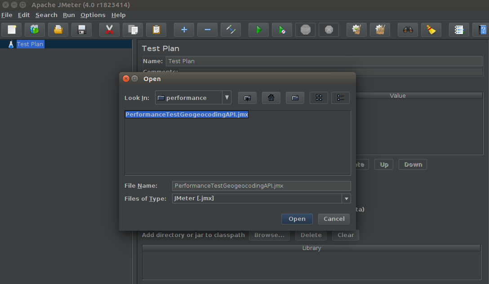
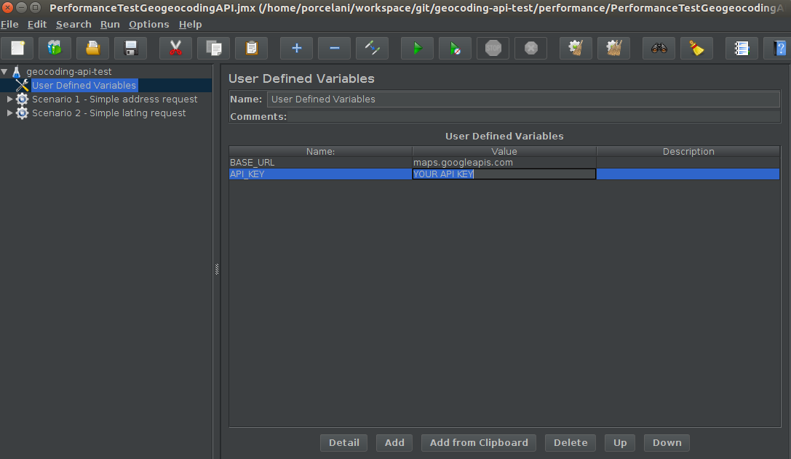
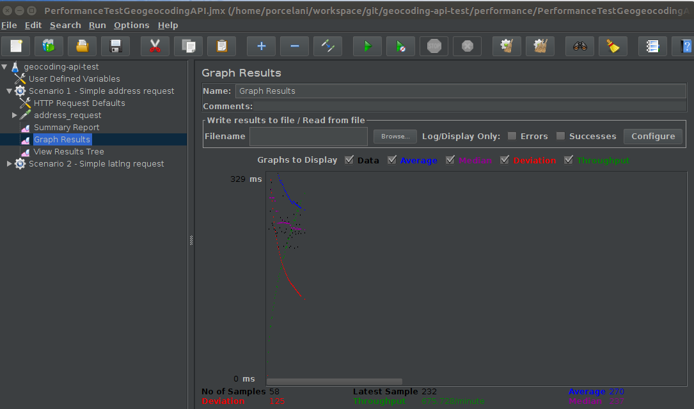

# Performance test

Given the characteristics demanded by the API tested, high availability and low response time, it is fundamental 
to guarantee its performance with load tests, stress and stability before each deploy, monitoring the environment 
tested in an unrelated production infrastructure. In the case of an infrastructure prepared for a BlueGreenDeployment, 
this could be accomplished in the new infrastructure that would take over the production.

This validation prepared with the JMeter tool will perform only two simple scenarios with status code 200 assert 
for the two tested APIs. Will not contemplate:
- Checking Json elements;
- Random and automatic generation of values for the query;

## Required
- Apache JMeter Program 4.0; 

## Prepare
- Import PerformanceTestGeogeocodingAPI.jmx file;

- Configure your API_KEY

## Run
- Execute and analise the results;

## Reference
- [Apache JMeter](https://jmeter.apache.org/)
- [BlueGreenDeployment](https://martinfowler.com/bliki/BlueGreenDeployment.html)
